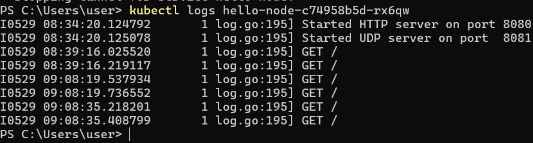
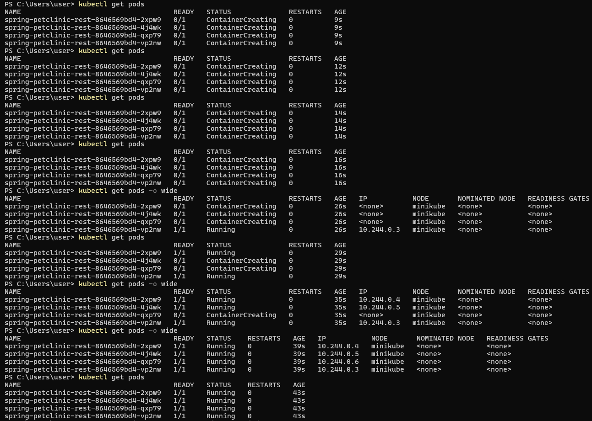

# Advanced Programming - Module 11 Deployment & Monitoring
**Nama:**   &nbsp; Stefanus Tan Jaya<br>
**NPM:**    &nbsp;&ensp; 2306152456<br>
**Kelas:**  &nbsp; Pemrograman Lanjut A<br>

### Reflection 1
1. **Compare the application logs before and after you exposed it as a Service. Try to open the app several times while the proxy into the Service is running. What do you see in the logs? Does the number of logs increase each time you open the app?**<br><br>

<br><br>
Bisa dilihat perubahan pada _logs_ sebelum dan sesudah _deployment_ di-_expose_. Awalnya, _logs_ hanya menunjukkan bahwa server HTTP dapat diakses di _port_ 8080 dan server UDP dapat diakses di _port_ 8081. Kedua _logs_ awal yang dihasilkan merupakan hasil _deployment_ dan pembuatan _pods_ yang telah berhasil dijalankan. Setelah _deployment_ di-_expose_, aplikasi dapat berinteraksi dengan server di luar Kubernetes. Maka dari itu, ketika saya membuka _link service minikube_, _logs_ mencatat setiap _request_ HTTP yang masuk beserta waktunya. Tentu saja setiap kali _link service_ diakses, _logs_ akan bertambah.<br><br>

2. **Notice that there are two versions of `kubectl get` invocation during this tutorial section. The first does not have any option, while the latter has `-n` option with value set to `kube-system`. What is the purpose of the `-n` option and why did the output not list the pods/services that you explicitly created?**<br><br>
_Flag_ `-n` pada _command_ `kubectl get` berfungsi untuk mendefinisikan _namespace_ yang ingin dituju. Jika tanpa `-n`, `kubectl` akan menuju _namespace_ 'default' yang berisi _pods_ dan _service_ yang sudah di-_expose_ sebelumnya. Dengan menggunakan `-n kube-system`, `kubectl` akan menuju _namespace_ 'kube-system' yang menampilkan semua _pods_ dan _service_ yang yang diperlukan oleh sebuah _cluster_ Kubernetes untuk berjalan.

### Reflection 2
1. **What is the difference between Rolling Update and Recreate deployment strategy?**<br><br>
Rolling Update adalah strategi _deployment_ di mana setiap ada _update_ versi, _pods_ baru akan dibuat bersamaan dengan mempertahankan _pods_ lama yang masih berjalan di belakang. Setelah _pods_ baru selesai dibentuk dan sudah berjalan, _pods_ lama akan di-_terminate_. Sementara itu, Recreate adalah strategi _deployment_ yang akan meng-_terminate_ semua _pods_ yang berjalan saat itu, kemudian _pods_ baru dibuat untuk menyediakan versi terbaru aplikasi hingga berhasil dijalankan. Kekurangan dari strategi Recreate ini adalah bisa membuat aplikasi _down_ untuk sementara waktu selama _update_ berjalan.<br><br>
2. **Try deploying the Spring Petclinic REST using Recreate deployment strategy and document your attempt.**<br><br>
Berikut cara saya membuat _deployment_ aplikasi dengan strategi Recreate:
    - Saya menjalankan _command_
        ```
        kubectl edit deployment spring-petclinic-rest
        ```
        untuk mengedit konfigurasi _deployment_ saat ini. Kemudian, saya mengubah _field_ `Strategy` yang awalnya di-_setting_ untuk Rolling Update menjadi Recreate.
        ```
        strategy:
            type: Recreate
        ```
    - Selanjutnya, saya mengubah versi aplikasi menjadi _latest_ untuk bisa memeriksa hasil dari _deployment_ yang diberlakukan dengan lebih mudah.
        ```
        kubectl set image deployments/spring-petclinic-rest spring-petclinic-rest=docker.io/springcommunity/spring-petclinic-rest:latest
        ```
    - Untuk memastikan _cluster_ Kubernetes bersih dari hasil _deployment_ sebelumnya yang menggunakan strategi Rolling Update, saya menjalankan _command_
        ```
        minikube delete
        minikube start
        ```
    - Waktunya menjalankan _deployment_ dengan _command_
        ```
        kubectl apply -f recreate-deployment.yaml
        ```
    - Saya dapat mengecek proses _deployment_ yang berlangsung dengan _command_
        ```
        kubectl get pods
        ```
        <br><br>
        Proses _deployment_ yang tampak pada gambar di atas sudah merepresentasikan definisi strategi Recreate, yaitu _pods_ sebelumnya dimatikan/di-_terminate_ dulu untuk membangun _pods_ yang baru.<br><br>

3. **Prepare different manifest files for executing Recreate deployment strategy.**<br><br>
Saya menyetor konfigurasi _deployment_ yang mengimplementasikan strategi Recreate ke dalam `recreate-deployment.yaml`<br><br>

4. **What do you think are the benefits of using Kubernetes manifest files? Recall your experience in deploying the app manually and compare it to your experience when deploying the same app by applying the manifest files (i.e., invoking `kubectl apply -f` command) to the cluster.**<br><br>
Dengan menggunakan _file_ manifest Kubernetes, kita bisa mendefinisikan dan mengelola bentuk _deployment_ aplikasi kita secara deklaratif dan programatis. Artinya, menggunakan _file_ manifest jauh lebih mudah dan efektif daripada harus menjalankan perintah untuk menyiapkan _deployment_ secara manual dan terpisah yang bisa memakan waktu lama dan beresiko ada langkah yang terlewat. Kita hanya perlu mendefinisikan keadaan yang diinginkan dari aplikasi dalam _file_ manifest, jalankan perintah `kubectl apply -f <nama_file>.yml`, dan Kubernetes akan menangani sisanya. Keuntungan lainnya datang dari segi reproduktibilitas, sebab kita bisa menerapkannya kembali di _cluster_ lain.